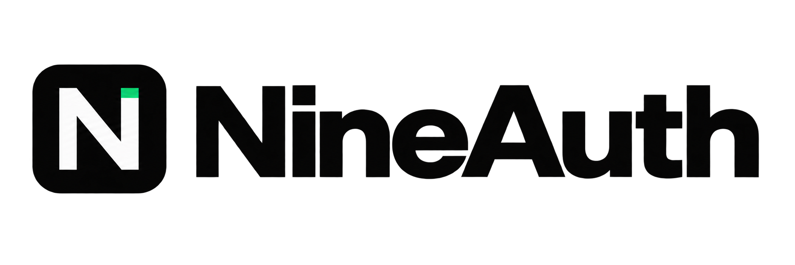



  <picture>
    <source media="(prefers-color-scheme: dark)" srcset="assets/logo-black.png">
    <source media="(prefers-color-scheme: light)" srcset="assets/logo-black.png">
    
  </picture>
    
  
<strong>Identity, Access &amp; Licensing Infrastructure</strong>

  
Server-side authentication and licensing for desktop and native software. Built for developers who ship.

   
  <a href="https://nineauth.xyz">Website</a>
  &nbsp;&middot;&nbsp;
  <a href="https://nineauth.xyz/docs">Docs</a>
  &nbsp;&middot;&nbsp;
  <a href="https://nineauth.xyz/dashboard">Dashboard</a>

---

## What is NineAuth

NineAuth is infrastructure for developers who need authentication, licensing, and access control that runs on the server — not on the client.

It handles the hard parts: hardware fingerprinting, token lifecycle, seat enforcement, subscription billing, and cascade revocation — so your application doesn't have to.

**Built for:** Desktop software (C#, C++), game launchers, commercial utilities, and any native application where client-side auth can be bypassed.

---

## Core Capabilities

| Capability | Description |
|---|---|
| **Authentication** | Argon2id password hashing. Opaque 256-bit session tokens stored as SHA-256 hashes at rest. |
| **HWID Locking** | Hardware fingerprint binding with configurable seat limits and automated reset quotas. |
| **License Engine** | Activation, entitlement checks, and instant cascade revocation on plan or license changes. |
| **Access Control** | Per-application, per-plan, per-user enforcement — managed from the dashboard or via API. |
| **Webhooks** | HMAC-SHA256 signed events with 5-stage exponential backoff retry queue. |
| **Billing** | Subscription lifecycle, trial management, and PIX payment processing. |
| **Developer Dashboard** | Full management console for applications, licenses, members, and billing — no CLI required. |

---

## SDKs

Official client libraries with anti-replay protection and zero local authorization logic.

| Language | Status | Repository |
|---|---|---|
| **C# (.NET · Unity)** | Available — v2.0.0 | [nineauth/sdk-csharp](https://github.com/nineauth/sdk-csharp) |
| **C++ (Native · Desktop · Unreal)** | Available — v2.0.0 | [nineauth/sdk-cpp](https://github.com/nineauth/sdk-cpp) |

All SDKs implement:

- Anti-replay protection via random nonces and strict UTC timestamp validation
- Zero local authorization logic — all business rules are enforced server-side
- Session tokens kept in memory, never written to disk

---

## Developer Resources

- **[Documentation](https://nineauth.xyz/docs)** — Integration guides, API reference, and SDK quickstarts
- **[Dashboard](https://nineauth.xyz/dashboard)** — Manage applications, licenses, members, and billing
- **[API Reference](https://nineauth.xyz/docs/api)** — REST API for management and runtime endpoints
- **[SDK Examples](https://github.com/nineauth/sdk-examples)** — Working C# and C++ integration examples

---

## Architecture

NineAuth runs as two distinct API surfaces:

- **Runtime API** (`/v1/runtime/*`) — The endpoint your application calls for login, token validation, and license activation. Designed to be embedded directly in your client SDK.
- **Management API** (`/v1/mgmt/*`) — Used by the Dashboard and your CI/CD pipelines to manage applications, users, licenses, and webhooks.

Sessions are short-lived (15 minutes) with SDK-side caching. Any license revocation instantly invalidates all active tokens for that user across all sessions.

---

   
  <strong>NineAuth</strong>
   
  Identity. Access. Licensing.
    
  <a href="https://nineauth.xyz">nineauth.xyz</a>

